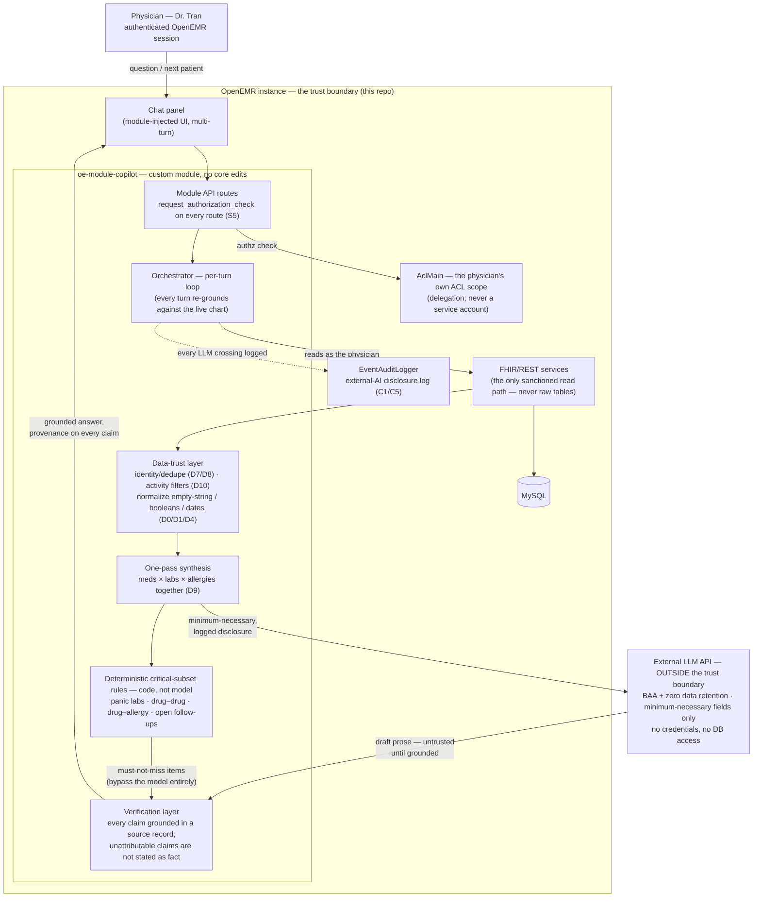

# ARCHITECTURE.md — Clinical Co-Pilot Agent

## Executive Summary

We are building a **clinical co-pilot**: a **multi-turn, tool-using
conversational agent** — not a dashboard — embedded in this OpenEMR instance.
In the physician's ~90-second window between patients it **opens with a
glanceable snapshot** (who the patient is, what changed since last visit, what
must not be missed, the thread from last time), **then answers follow-ups
grounded in the chart**; every capability traces to a use case in `USERS.md`
§5 (UC1–UC5). It is deliberately **not** an autonomous decision-maker — the
agent orients, the physician decides. One framing drives both **adoption**
(Dr. Ellis Tran — a still-*unvalidated* persona — will not trust a black box)
and **regulatory posture** (reviewable-basis clinical decision support is
likelier to stay off the FDA device line).

**Where it lives (Decision 1).** In-repo, as an **OpenEMR custom module**
registered through the sanctioned module/event system — no core edits.
Orchestration (retrieval, data-trust, synthesis, prompt assembly) lives in the
module; only model inference is external. In-repo beats a standalone service
because it **reuses OpenEMR's authentication, ACL, session, and data access**,
avoids a second store of patient data, and reaches a defensible MVP fastest.
Tradeoff: we inherit the PHP runtime and cannot scale inference independently
— accepted for v1, mitigated by keeping orchestration cleanly extractable.

**How it accesses data (Decision 2).** Reads go **only through the FHIR/REST
surface** — the one validated, uuid-resolved read path — never raw legacy
tables. Because the datastore does not defend its own integrity (strict mode
off **D0**, empty-string-as-missing **D1**, duplicate patients **D8**,
stale-med flags **D10**), a **data-trust layer** resolves identity, dedupes,
filters, and normalizes **before** the model, and a **single synthesis pass**
reconciles meds, labs, and allergies so cross-source interactions can't fall
through a seam (**D9**). Tradeoff: latency and engineering cost vs.
correctness — non-negotiable here.

**Authorization (Decision 3).** The agent acts as the physician **by
delegation, not impersonation** — its authority is always his own, confined to
his ACL/facility scope, never a privileged service account, so it can only
surface what he could already see. Delegation (not *"runs inside his live
session"*) keeps that true when he is **offline**; v1 scopes pre-charting to
his live session and defers unattended overnight batch (§4). The **LLM sits
outside the trust boundary**: every crossing is a logged, minimum-necessary
disclosure under a signed BAA with zero data retention (**C5**).

**Risk posture (Decision 4).** Content can be wrong in **two directions**.
**Provenance** on every surfaced claim defends what *is* shown — a wrong fact
he can catch — and satisfies FDA reviewability, but cannot reach what was
never surfaced. So a **clinical-accuracy gate** defends against omission:
correctness is **measured before delivery** against a human-adjudicated
golden-chart set (founder in v1), with a **zero-miss bar on a deterministic
critical subset enforced in code**, not model judgment. Breach-precursor gaps
(**S1/S2/S3**) close before exposure.

**Biggest open risk:** the persona is unvalidated and (decided 2026-07-07)
there is no external design-partner internist — **Phase 0 validation is run
in-house**, the no-clinician limitation named; real-clinician review is the
highest-leverage upgrade when available.

---

## 1. Scope

- **In (v1):** read-only orientation for the physician's own established patients, delivered through a **multi-turn conversational agent** — it **opens with a glanceable snapshot**, then answers **on-demand follow-ups** grounded in the chart; plus an overnight pre-chart of the panel; everything traceable to its source. *(The conversational surface is the core; the snapshot is its opening turn.)*
- **Out (v1):** no write-back (notes/orders); no autonomous action; local records
  only (accepted blind spot for cross-system changes); not the covering /
  new-patient states (fast-follow — higher value, harder).
- **Principle:** orientation aid, human-in-the-loop, never autonomous.

**Capability → use-case trace** (per the case-study rule: no capability without
a `USERS.md` §5 use case):

| Agent capability | `USERS.md` use case | Status |
|---|---|---|
| Glanceable between-patient snapshot (the opening turn) | **UC1** | v1 |
| Multi-turn, grounded follow-up Q&A (the reason this is an agent, not a report) | **UC2** | v1 |
| Session-bound pre-chart of the day's schedule | **UC3** | v1 |
| Deterministic must-not-miss critical subset + provenance on every claim | **UC4** | v1 |
| Cold orientation for covering / new-patient states (S2/S3) | **UC5** | Phase 4, not v1 |

## 2. Where the agent lives

**Decision: an in-repo OpenEMR custom module (`oe-module-copilot`), no core edits.**
Orchestration runs in the module; only model inference is external.

*Per-request runtime flow. The build-time clinical-accuracy gate (§6) sits
outside this loop: it runs the golden-chart set on every build change and fails
the build on a critical-subset miss.*

| | In-repo module *(chosen)* | Standalone service *(rejected v1)* |
|---|---|---|
| Auth / ACL | reuses OpenEMR's | re-implement |
| Patient-data store | none new | new store + security surface |
| Data access | native FHIR/REST | cross-network, duplicated |
| Inference scaling | coupled to PHP | independent |
| Time to MVP | fast | slow |

**Tradeoff:** PHP coupling and no independent inference scaling — mitigated by
keeping orchestration extractable.

**Framework & model choices.** No Python agent framework (LangChain/LangGraph/
CrewAI) — those assume a standalone service, which Decision 1 rejects.
Orchestration is custom, in-module PHP against the sanctioned seams
(`openemr.bootstrap.php` → event subscriptions + routes via
`RestApiCreateEvent`); the model is a Claude-class LLM procured under **BAA +
zero data retention** (Anthropic direct or via a cloud BAA, e.g. Bedrock) —
the gating requirement is *compliance-capable inference with tool use*, not a
model family. Single agent, deliberately **not** multi-agent: the dangerous
errors live *between* sources (D9), so per-source sub-agents would let
interactions fall through the seam. Full option-by-option rationale:
`docs/onboarding/PRE_SEARCH.md`.

## 3. How it accesses patient data

1. **Read path — clean surface only.** All reads via FHIR/REST (validated,
   paginated, uuid-resolved). Never raw tables or the legacy bootstrap (`globals.php`)
   — that path is slow (`P1/P2`), unbounded (`P4`), and exposes every data-quality
   landmine directly.
2. **Data-trust layer (before the model).** Identity resolution / dedup (`D7/D8`);
   drop inactive rows (`D10`); collapse duplicate list entries (`D9`); normalize
   empty-string and boolean values (`D0/D1/D4`).
3. **Synthesis — one pass.** Reconcile meds, labs, and allergies together and check
   cross-source interactions in a single pass; no isolated per-source summaries
   (the interaction lives *between* them — `D9`).
4. **LLM boundary.** Send only minimum-necessary fields → an endpoint under BAA +
   zero data retention → log the disclosure (`EventAuditLogger`, new external-AI
   category, `C1/C5`) → attach provenance to every returned claim.
   **The compression/preservation seam (named explicitly):** minimum-necessary
   is a **COMPRESSION** rule — send less, never more; honest-uncertainty is a
   **PRESERVATION** rule — never let trimming manufacture false certainty. They
   pull in opposite directions, and the seam bites hardest at absence: a chart
   *assessed with nothing recorded* (known-absent, e.g. NKDA) and a chart
   *never assessed* (unknown) both serialize to "no entries" unless the
   distinction is carried deliberately. Trimming must never destroy it (`D1`) —
   the payload carries a per-data-class absence marker through one canonical
   `CurrencyWire` mapper (known-absent vs the one Unknown token, used for all
   data classes, never inferable as false), disclosed like any other crossing.
5. **Conversation context.** Multi-turn context is an in-memory convenience for the encounter only — not persisted beyond the encounter, no new patient-data store (consistent with Decision 1), so it adds no PHI-at-rest. The real constraint is correctness, not storage: **every turn re-grounds against the live chart and provenance**, so being multi-turn can't (a) answer from stale context when the record has changed mid-conversation, or (b) treat the model's own earlier output as a source. Prior turns inform phrasing and intent, never facts.
6. **Writes:** none in v1.

## 4. Authorization boundaries

**Acts as the physician — by delegation, not impersonation.** The agent's authority
is always the physician's own, confined to his ACL/facility scope, never a privileged
or population-wide service account. It reuses `AclMain` — no parallel authz model — so
it can only surface what he can already see, and facility/tenant scope is inherited.
The one-word widening is load-bearing: *"runs inside his live session"* breaks the
moment the session ends (the overnight batch); *delegation* keeps "acts as the
physician" literally true even when he is **offline**.

**Mechanism — two paths, least-privilege identical in both:**

- **Session-bound (preferred; all of v1).** Wherever a real session exists, run inside
  it — kick the next-day pre-chart off as a background job from his still-authenticated
  evening session (the pajama-time window the product aims to *shrink*, but for now a
  free auth window), or as an at-login warm-up. No new credential, no standing token;
  the claim is literal.
- **Offline grant (cold-start — deferred, §7).** When he was never online, use a
  **per-physician, read-only offline grant**, not a service account: the co-pilot is a
  confidential OAuth client; each physician grants it a SMART `offline_access` scope,
  read-only, minimum FHIR resources. Each nightly run mints a **short-lived** access
  token whose scope is **re-derived from his current ACL at mint time**, so a
  permission change or offboarding takes effect immediately. The refresh secret lives
  in a secrets manager, never the DB, and dies at offboarding. **Honest cost:** that
  grant *is* standing access and the token store becomes a target — but it is
  read-only, per-physician, and least-privilege is enforced by the **token's scope, not
  application code**. It is strictly smaller than the population-wide service account
  already rejected.
- **Rejected — a scheduled batch service identity that "assumes" each physician's scope
  in code.** That makes least-privilege an *application-code invariant* rather than an
  *identity-layer property*: one bug and the blast radius is every patient, not one
  physician's panel — the exact contradiction with the crown-jewel least-privilege
  claim. Naming why we did *not* do this is stronger than defending why we did.

- **Per-route default-deny.** Every route the module adds enforces
  `request_authorization_check`; OpenEMR has no default-deny gate (`S5`), so an
  omitted check is an open endpoint.
- **LLM outside the trust boundary.** Treated as an untrusted processor: receives
  only minimum-necessary data under BAA + zero retention, never gets credentials or
  DB access, and its output is unverified until grounded against provenance.
  **C5 status (recorded 2026-07-08): the BAA/ZDR is stipulated by the program,
  not a real BAA** — the requirements direct us to use demo data only and to
  act as if a signed BAA with zero-training terms exists with all LLM
  providers. The disclosure-logging and minimum-necessary *mechanisms* are
  real, enforced, and graded; procuring an actual BAA is a real-world
  deployment prerequisite, not an in-project blocker.

> **One-sentence defense.** Overnight pre-charting uses delegated authority, not
> impersonation — the physician grants a read-only, revocable offline scope, so the
> batch runs strictly within his own ACL and can't exceed it. That's standing access,
> but read-only and per-physician, deliberately smaller than the service account we
> rejected. For v1 we scope pre-charting to session-bound and defer unattended batch
> until that grant model is built.

## 5. Risks and mitigations

*Bold = where it's enforced.*

| # | Risk | Root | Mitigation | Enforced in |
|---|---|---|---|---|
| R1 | Patient data to LLM without compliance | C5 | BAA + zero retention + minimum-necessary + disclosure logging | §3.4, §4 |
| R2 | Patient-data conflation | D8 | identity resolution / dedup before synthesis | §3 |
| R3 | Garbage-in, laundered into a clean summary | D0/D9/D10 | data-trust layer | §3 |
| R4 | Missed cross-domain interaction (the seam) | D9 | single synthesis pass, no isolated summaries | §3 |
| R5 | Automation bias → over-reliance (behavior) | USERS §8 | preserve-distrust UX; honest uncertainty; must-not-miss visually distinct; silence when nothing changed | UI |
| R6 | Commission — a wrong fact in what IS shown | USERS §9 | provenance at point of use + factual-accuracy floor + human review | §3.4, §6 |
| R13 | Omission — a must-not-miss item never surfaced (provenance/human review do NOT reach this) | USERS §8, §9 | accuracy gate + deterministic critical subset in code + production omission monitoring | §6 |
| R7 | Over-flagging → alert-fatigue churn | USERS §9 | measured precision floor, same gate | §6 |
| R8 | Breach precursors | S1/S2/S3 | close error leak + cookie hardening before exposure | §7 (P1) |
| R9 | Authorization omission | S5 | module default-deny; per-route checks | §4 |
| R10 | Liability / FDA device line | persona/C5 | reviewable-basis: provenance + human decides, never autonomous | §3.4 |
| R11 | Degraded-mode dependence (worst when covering) | USERS §3/§8 | honest uncertainty, graceful failure, never a silent wrong answer | UI |
| R12 | Optimizing for a physician who doesn't exist | USERS §2 | founder-run Phase 0 validation — no external clinician, residual risk accepted and named | §7 (P0) |
| R14 | Standing offline-access grant / token store as a target *(deferred phase only)* | delegation, §4 | read-only, per-physician, short-lived tokens; scope re-derived from current ACL at mint; refresh secret in a secrets manager, revoked at offboarding; strictly smaller than the rejected service account | §4 |

## 6. Output verification — the clinical-accuracy gate

Provenance catches errors in what's shown; it cannot catch what was never shown
(omission, R13). So correctness is **measured before it reaches the physician**, not
just traceable after.

- **Ground truth** per (chart-state, visit), human-adjudicated — **founder in
  v1; no practicing clinician has reviewed the labels (a named limitation)**: the
  **must-not-miss set** + the **key facts** to be stated correctly. Scored in two
  directions — omission (R13) and commission (R6).
- **Critical subset = a code guarantee, not model judgment.** The highest-stakes
  items — panic labs, drug–drug contraindications, drug–allergy conflicts, open
  follow-ups — are detected by **rules in the data-trust/synthesis layer**; the
  model only writes the surrounding prose. Target: **zero misses.** This is the key
  move — the worst omissions leave the model entirely.
- **The critical subset is DELIBERATELY NARROW — selection, not omission.**
  `PHASE0.md` §3a.5 names the coverage gap explicitly: the panic-lab table
  tracks 5 analytes where ARUP lists ~13 adult criticals (INR, calcium,
  magnesium, hs-troponin, digoxin, and lithium are absent — PL-10–15); the
  DDI table encodes 3 single-ingredient pairs, so the class-vs-member gap
  means `warfarin–ibuprofen` does not reach naproxen or ketorolac, and
  high-harm published pairs (statin+CYP3A4, QT+QT, SSRI+MAOI) are absent;
  the sulfonamide allergy grouping is UNSOURCED and never gates. Widening
  the subset is a clinical-governance decision with a citation, not an
  engineering edit — "zero misses" is claimed for the subset as scoped,
  nothing more.
- **Judgment-based items** (a subtle care gap, a trend) keep a **governed recall
  floor**, set by the in-house clinical-governance owner (founder in v1; revisit
  with a real clinician when available).

| Metric | Guards | Bar |
|---|---|---|
| Recall on must-not-miss | omission (R13) | **zero misses** on the critical subset; governed floor on judgment items |
| Precision on flagged | alert fatigue (R7) | governed floor — he doesn't tune the panel out |
| Factual accuracy on shown claims | commission (R6) | governed floor; each violation a candidate churn event |

- **The gate.** Any build change re-runs the **golden-chart set**; any miss on the
  critical subset or any metric below floor **fails the build** — the red/green loop
  applied to clinical output. **Status (2026-07-08): ARMED on the `PHASE0.md`
  §3a reference-grounded set only**, signed off by the acting clinical-
  governance owner (§9) as one decision with the detector tables (`PHASE0.md`
  §3c). §3b judgment items stay provisional-unadjudicated and never gate;
  UNSOURCED items (the sulfa grouping, DA-4) never gate.
- **The golden-chart set** grows from curated cases (across the states and the
  complexity mix, `USERS §3/§7`, and the audit's interaction landmines, `D9`)
  plus **production near-misses**, so it ratchets: once missed, never silently
  missed again. Adjudicated in-house by the Phase 0 owner (founder in v1);
  real-clinician review of the labels is pending.
- **Online:** watch omission leading indicators (click-through to un-surfaced data,
  overrides, "why didn't it show X") — these feed the golden set.
- **Observability.** Two traces, both in-repo: the **disclosure log**
  (`EventAuditLogger`, external-AI category, C1) is the compliance-grade record
  of every LLM crossing — who, which patient, what data class, when; the
  **golden-chart harness** is the correctness record. Per-request we log tool
  sequence, per-step latency, tool failures, and token counts, so "what did the
  agent do, how long did each step take, did a tool fail, what did it cost" is
  answerable from logs; snapshot p95 latency and precision/recall floors are
  the watched metrics (§6 table). A dedicated LLM-tracing product can be
  layered later; it is not load-bearing for v1
  (`docs/onboarding/PRE_SEARCH.md` §8).
- **Limits.** The gate *bounds and monitors* omission; it does not eliminate it.
  Be precise: critical-subset misses are a **code guarantee we verify**;
  judgment-based misses are **monitored, not guaranteed.** And the gate is only
  as clinically sound as its adjudicator — founder-adjudicated in v1, a named
  limitation until a real clinician reviews the set.

## 7. Roadmap

Foundations first. Phases 1–2 are audit-driven remediation and proceed on the
audit's own evidence; Phase 0 gates what depends on the *user being real* —
Phase 3 and the arming of the accuracy gate — and Phases 3–5 gate sequentially.

- **Phase 0 — Validate the user** *(gates Phase 3 and the arming of the
  accuracy gate — NOT the audit-remediation Phases 1–2, which are
  audit-driven and already green; run in-house — decided 2026-07-07;
  delivered as `PHASE0.md`).* No external design-partner internist: we create
  the design-partner function ourselves — a structured, founder-run pass over
  the 90-second moment, the four needs, and the state mix (`USERS §3`) using
  the `USERS.md` "→ Test by" prompts as the protocol. H1/H2/H10 turned out to
  be **program-stipulated** (the case study hands us the 90-second moment,
  the multi-turn agent shape, and answer-in-seconds), so Phase 0 no longer
  gates anything in-project; its residual — real-clinician validation of the
  persona and labels (R12) — stays open for the real world. The no-clinician
  limitation stays named; real-clinician review is a post-MVP upgrade, not a
  blocker.
- **Phase 1 — Compliance & security.** BAA + zero retention; minimum-necessary
  policy; disclosure logging (`C1/C5`); close `S1/S2/S3`; module skeleton + FHIR
  read path.
- **Phase 2 — Data-trust substrate.** Identity/dedup, filtering, normalization,
  one-pass synthesis; the deterministic critical-subset rules (the §6
  critical-subset items); the initial golden-chart set, labels seeded by the
  in-house Phase 0 adjudication.
- **Phase 3 — Orientation MVP** *(read-only, established patients first; gated on
  the accuracy gate passing).* **Session-bound** pre-chart — kicked from his live
  evening session or an at-login warm-up (§4) — + glanceable snapshot; provenance on
  every item.
- **Phase 4 — Covering / new-patient states + on-demand** (where degraded-mode
  matters most).
- **Phase 5 — Write-back** *(deferred, separately gated, not v1).*

**Also deferred — unattended overnight batch.** True cold-start pre-charting (he was
never online) via the per-physician read-only **offline-grant** model (§4). The
direction is named now; v1's pre-chart is session-bound, so this is off the critical
path — deferred exactly as write-back and the S2/S3 states are.

**Early Submission target:** Phases 0–2 defensible on paper + a Phase 3 read-only
snapshot demo.

## 8. Decisions to defend

1. **In-repo module, external inference** — reuse OpenEMR's auth/data; accept PHP
   coupling. (§2)
2. **FHIR/REST read path only** — correctness over convenience. (§3)
3. **Data-trust + one-pass synthesis before the model** — the store doesn't defend
   itself, and the dangerous errors live *between* sources. (§3)
4. **Agent acts as the physician by delegation, not impersonation** — least privilege
   holds even when he's offline; the population-wide service account is rejected. v1 is
   session-bound; unattended batch via a per-physician offline grant is deferred.
   (§4, §7)
5. **LLM outside the trust boundary** — every crossing a logged, minimum-necessary
   disclosure under BAA + zero retention. (§4)
6. **Provenance defends what's shown and satisfies FDA reviewability** — it does
   *not* reach omission. (§5 R6/R10)
7. **Validation is run in-house and stays honest** — the persona is a hypothesis;
   the design-partner function is self-created (no practicing clinician), and that
   limitation is named rather than hidden. (§7 P0)
8. **Correctness is measured before delivery, not just traceable after** — the
   accuracy gate, with zero misses on a code-enforced critical subset, is the answer
   to invisible omission (R13). (§6)

## 9. Open questions

- ~~Do we have a real design-partner internist?~~ **Decided 2026-07-07: no — and
  we are not recruiting one this sprint; the design-partner function is created
  in-house (§7 P0).** The open question is now *when and how a real clinician
  reviews the persona and the golden-chart labels* — both carry the
  founder-adjudication limitation until then.
- **Buyer named — the hospital CTO** (the case study's own standard: *defend it in front of a hospital CTO deciding whether to put it in front of their physicians*). **Still open:** the CTO's success metrics (throughput, liability, compliance, quality scores) vs. the physician-user's (eye-contact, pajama-time) are partly in tension — which we're held to shapes the definition of success. (`USERS §10`)
- ~~Who owns clinical governance of the critical-subset definition and the
  metric floors?~~ **Decided 2026-07-08: the founder is the acting
  clinical-governance owner.** He signed off the `PHASE0.md` §3a
  reference-grounded labels ONLY — one decision covering both the detector
  draft tables and the gating labels (`PHASE0.md` §3c) — which armed the
  accuracy gate on that set. §3b judgment items stay provisional and never
  gate. "Acting" is doing real work in that sentence: this is a founder
  standing in for a clinician, a named gap carried until a real internist
  reviews the set (§6). Still open: the metric floors themselves.
- **C5 BAA/ZDR is stipulated by the program, not procured** (recorded
  2026-07-08; see §4): demo data only, act-as-if a zero-training BAA exists.
  The real-world question — which compliance-capable inference endpoint and
  actual BAA — stays open for deployment.
- What latency does the between-patient moment tolerate? *(95th-percentile target,
  set during in-house Phase 0; revisit with a real clinician.)*
- De-identification: any task where we can avoid sending identified data at all?
  *(Constrained by `D7/D8` — treat as unreliable for v1.)*
- The **offline-grant model** for unattended overnight batch (§4, deferred): does
  OpenEMR's existing OAuth2/SMART server already support a confidential client with
  per-physician read-only `offline_access` and scope re-derived from current ACL at
  token mint — or must that be built? *(Enabling capability tracked as an as-found
  question in `docs/onboarding/OPEN_QUESTIONS.md` #25.)*

---

*This document is forward-looking — nothing is implemented yet. The audit
([`AUDIT.md`](AUDIT.md); its AI-impact prioritization is Part 0) is the
evidence base for every finding cited here (IDs `S#`/`P#`/`D#`/`C#`); the use
cases (UC1–UC5) are defined in [`USERS.md`](USERS.md) §5; the as-found system
is described in `docs/onboarding/CURRENT_ARCHITECTURE.md`; specialist terms
are in `docs/onboarding/GLOSSARY.md`. Baseline commit `859d6d3`.*
